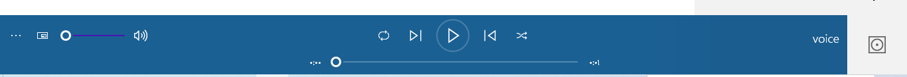

Expected Output
===============

Once you run transcribe.py with a timeout value (-t) you'll get both
incremental output as data comes back, as well as a final stitching of
things together. The output will look something like this.
I'm here 
I'm here 
I'm here 
I'm here 
I'm here to 
I'm here to 
I'm here to 
I'm here to 
I'm here to help 
I'm here to help 
I'm here to help 
I'm here to help you 
I'm here to help you 
I'm here to help you 
I'm here to help you 
I'm here to help you 
I'm here to help you 
I'm here to help you 
I'm here to help you 
I'm here to help you 
* done recording
sure how can I help you yes I'm here to help you 

