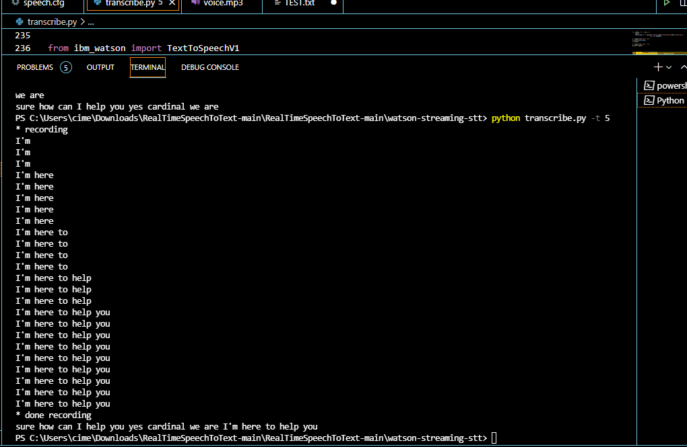

In this task I converted my voice to text and used a code to save the speech to text az .txt output and save the text to speech az .mp3 output
audio: 

output like: 
Once you run transcribe.py with a timeout value (-t) you'll get both
incremental output as data comes back, as well as a final stitching of
things together. The output will look something like this.

